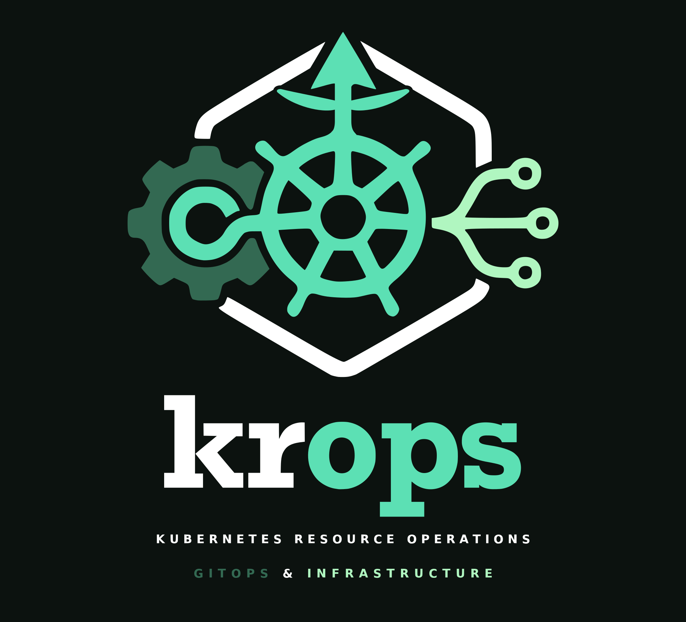

# krops
## kubernetes resource operations



krops is a GitOps pattern for managing infrastructure through the Kubernetes API
with plain declarative YAML. Terraform and OpenTofu use HCL, a state file, and
discrete plan/apply runs; krops stores desired state as Kubernetes resources in
Git. [Flux](https://fluxcd.io/) delivers those resources, and controllers
continuously reconcile the infrastructure to match them. Kubernetes provides
one API, RBAC model, policy surface, and audit trail for infrastructure and
workloads. No HCL, no `.tfstate`, no second toolchain.

[Crossplane](https://www.crossplane.io/) is the closer comparison because it
also runs infrastructure reconciliation inside Kubernetes. Its providers expose
managed resources, while XRDs and compositions can turn them into higher-level
platform APIs. krops introduces no krops-specific CRD or controller: it combines
[Cluster API](https://cluster-api.sigs.k8s.io/) for clusters,
[ACK](https://aws-controllers-k8s.github.io/docs/) for AWS resources, and Flux
for GitOps. If those resource APIs already say what you mean, krops does not
wrap them to say it again.

This repository demonstrates the pattern end to end on AWS EKS, local Docker
clusters, and a Tinkerbell-provisioned [Talos Linux](https://www.talos.dev/)
machine. A disposable [kind](https://kind.sigs.k8s.io/) cluster bootstraps Flux,
CAPI pivots control to a self-managed management cluster, and the Rust
[`krops-bootstrap`](docs/bootstrap-cli.md) CLI handles bootstrap, pivot, and
teardown. After that, everything is declared in Git, with a
[Zarf](https://zarf.dev/) bundle for air-gapped local installs. It is a working
reference implementation, not a product, so fork it, strip it down, and adapt
it to your own cloud and clusters.

## Who this is for

Platform engineers who already run Kubernetes and want to manage their own
cloud infrastructure with the same API, RBAC, audit trail, and GitOps workflow
they use for workloads. If you're reaching for Terraform/OpenTofu, Pulumi, or
Crossplane to stand up cloud resources for Kubernetes, this pattern is the
alternative: the cluster you already operate becomes the control plane. It is
not a developer self-service portal; you are the consumer.

## Problems the pattern solves

- **State files**: drift, locking, corruption. Controllers reconcile actual
  state continuously instead of diffing a snapshot.
- **The plan/apply gap**: PRs are reviewed as **rendered** Flux diffs (blast
  radius, image changes, render failures) by
  [konflate](https://github.com/home-operations/konflate): a GitHub Actions
  workflow runs it on every PR push as a merge gate, and an in-cluster
  instance posts the summary to the PR. You review byte-for-byte what
  reconciles. See [docs/konflate.md](docs/konflate.md).
- **Two toolchains**: HCL for infra, YAML for workloads. One control plane
  means RBAC, policy, and audit cover both.
- **Lifecycle split**: Terraform builds the cluster but can't manage what's
  in it. CAPI + Flux is one dependency graph from cluster to workload.
- **A control plane on a laptop**: the management cluster is not a long-lived
  local kind cluster. The bootstrap kind cluster is disposable, and after the
  pivot the management cluster manages itself through the same GitOps flow it
  drives.


## Prerequisites

The toolbox container is the primary lifecycle interface. A container user
needs only the repository checkout and a running engine:

- Docker, or Podman 5.5+; kind creates clusters through the mounted engine
  socket
- The toolbox image. No semver release has been published yet, so build the
  current checkout with
  `docker build -f bootstrap-rs/Dockerfile -t krops-toolbox:dev .`

A future matching `v*` tag publishes
`ghcr.io/polarsquad/krops-toolbox` for Linux amd64 and arm64 as `X.Y.Z`,
`X.Y`, and stable `latest`, with a keyless signature and SPDX SBOM
attestation. The `aws` environment additionally requires a GitHub PAT with
read access, AWS credentials and service quotas, and an age private key. The
`local-talos` environment needs the PAT and age key too (it syncs from
GitHub), plus a reachable Tinkerbell stack and the site values in
`mgmt/local-talos/clusters/management/cluster.yaml`; see
[Operations](docs/operations.md).

Native development and air-gap work additionally need:

- Mise 2026.8.10 or newer
- Rust via [rustup](https://rustup.rs/) when building the CLI outside the
  image; the pin lives in `bootstrap-rs/rust-toolchain.toml`

## Quickstart

Build the current checkout and run the complete local-host lifecycle with only
Docker installed:

```sh
docker build -f bootstrap-rs/Dockerfile -t krops-toolbox:dev .
mkdir -p .kube
docker run --rm -it \
  -v "$PWD:/workspace" -w /workspace \
  -v /var/run/docker.sock:/var/run/docker.sock \
  -v "$PWD/.kube:/root/.kube" \
  -e KUBECONFIG=/workspace/.kube/kind.yaml \
  krops-toolbox:dev local-host

# Teardown uses the same mounts and the teardown subcommand:
docker run --rm -it \
  -v "$PWD:/workspace" -w /workspace \
  -v /var/run/docker.sock:/var/run/docker.sock \
  -v "$PWD/.kube:/root/.kube" \
  -e KUBECONFIG=/workspace/.kube/kind.yaml \
  krops-toolbox:dev teardown local-host
```

Use `ghcr.io/polarsquad/krops-toolbox:<version>` instead of the local image
for a published release. The AWS form must also pass the Git source, PAT, age
key path, and any AWS credential variables. Podman socket paths vary by host.
`scripts/toolbox-run.sh` handles those mounts, loads `.env` without preserving
quote characters, and persists kubeconfigs under `.kube/`; see
[Operations](docs/operations.md) for both forms.

For hosts with mise, the lifecycle tasks call that wrapper. Installing the
pinned native tools also enables key generation, validation, and inspection:

```sh
docker build -f bootstrap-rs/Dockerfile -t krops-toolbox:dev .
export TOOLBOX_IMAGE=krops-toolbox:dev
mise trust
mise install
cp .env.example .env        # aws and local-talos: fill in the Git source and PAT
mise run sops-keygen         # first time only: age key for SOPS
mise run bootstrap           # toolbox: bootstrap, Flux handoff, then pivot
export KUBECONFIG="$PWD/.kube/krops-mgmt.yaml"
flux get kustomizations --watch
mise run validate            # shell syntax, bootstrap.toml cross-check, overlays
mise run teardown            # toolbox: reverse-order lifecycle cleanup
```

Dependency versions are managed by Renovate
([renovate.json5](renovate.json5)) running as the hosted GitHub App; they live
in their native consumer files and update PRs open weekly. See
[Dependencies](docs/dependencies.md).

### Environments

The shared toolchain is defined in `mise.toml`. AWS-specific tools are layered
through `mise.aws.toml`; use the `aws` environment when those tools are
needed. The `local-host` environment creates the management kind cluster, a
local OCI registry, and the Flux Operator and FluxInstance. It publishes the
`mgmt/local-host/` and `workload/local-host/` folders as the `krops:latest`
OCI artifact. Flux installs CAPI with its Docker infrastructure provider (CAPD),
provisions a local one-control-plane/one-worker workload cluster, and installs
a separate Flux instance there. That workload Flux instance reconciles Podinfo,
providing an end-to-end local path from management-cluster bootstrap through
workload delivery and application access. This covers the complete GitOps and
CAPI lifecycle without provisioning AWS resources:

```sh
docker build -f bootstrap-rs/Dockerfile -t krops-toolbox:dev .
export TOOLBOX_IMAGE=krops-toolbox:dev
mise -E local-host install
mise -E local-host run bootstrap
export KUBECONFIG="$PWD/.kube/krops-mgmt.yaml"
mise -E local-host run oci-push  # republish local management and workload paths
mise -E local-host run kubeconfigs
mise -E local-host run podinfo-port-forward  # http://localhost:9898
mise -E local-host run teardown
```

The Flux charts are pulled anonymously. The AWS environment requires a
GitHub PAT so Flux can clone this repository; the local-host environment does
not require GitHub or AWS credentials.

`mise -E local-host run bootstrap` waits for both the management and workload
Flux reconciliation chains and surfaces workload reconciliation errors. A
successful bootstrap, followed by the Podinfo port-forward, verifies the
end-to-end local-host flow.

Local-host teardown deletes the CAPD workload cluster first, then removes the
pre-pivot kind cluster or the post-pivot self-managed management containers,
and removes the local registry last. AWS teardown discovers the active
controller host, deletes the workload clusters, sweeps orphaned resources in
both workload regions plus the self-managed management cluster, and removes
the `clusterawsadm` CloudFormation stack.

The `local-talos` environment targets a physical machine through Tinkerbell:
a PXE install of Talos Linux, then the same bootstrap, pivot, and
self-management flow, synced from GitHub. It needs the GitHub PAT and age
key, a reachable Tinkerbell stack with a `Hardware` resource for the
machine, and the site values in
`mgmt/local-talos/clusters/management/cluster.yaml`:

```sh
mise -E local-talos install  # adds talosctl
mise -E local-talos run bootstrap
export KUBECONFIG="$PWD/.kube/krops-mgmt.yaml"
mise -E local-talos run kubeconfigs
mise -E local-talos run teardown  # releases the Hardware; never wipes the machine
```

## The bootstrap CLI

The single `krops-bootstrap` binary implements bootstrap, the default pivot, and
`krops-bootstrap teardown`. Repository-owned cluster names, paths, chart
versions, provider manifests, and teardown targets come from
[`bootstrap.toml`](bootstrap.toml); `mise run validate` cross-checks that file
against the Git manifests. Sequence-level behavior and generic fallback
defaults remain in the binary.

`mise run bootstrap`, `pivot`, and `teardown` now run the CLI through the
toolbox wrapper. The shell scripts remain native reference and fallback paths
until all environments complete parity runs; local-host has passed the full
lifecycle, while AWS parity still gates retirement. See
[The bootstrap CLI](docs/bootstrap-cli.md) for the interface, configuration,
teardown controls, toolbox release, and current parity status.

## Documentation

| Page | Contents |
|---|---|
| [docs/bootstrap-cli.md](docs/bootstrap-cli.md) | The `krops-bootstrap` lifecycle CLI: toolbox distribution, interface, `bootstrap.toml`, pivot, teardown, parity status |
| [docs/dependencies.md](docs/dependencies.md) | Renovate-managed dependency updates: covered surfaces, update procedure, intentional differences |
| [docs/architecture.md](docs/architecture.md) | Architecture diagram, reconciliation order, how workload apps are delivered |
| [docs/aws-iam.md](docs/aws-iam.md) | EKS Pod Identity, ACK controller IAM roles, per-cluster reader roles, the `krops-reader` console user |
| [docs/workload-resources.md](docs/workload-resources.md) | S3 bucket security posture, RDS instances, known limitations |
| [docs/konflate.md](docs/konflate.md) | Rendered Flux PR review: GitHub Actions gate, in-cluster instance, write-back to PRs, tokens |
| [docs/secrets.md](docs/secrets.md) | SOPS + age secret management, key setup, credential rotation |
| [docs/operations.md](docs/operations.md) | Toolbox runtime, prerequisites, quotas, bootstrap, pivot recovery, teardown, validation |
| [docs/extending.md](docs/extending.md) | Adding a workload cluster, adding apps to the workload clusters, adding other providers (Azure, Talos, k0smotron) |
| [docs/airgap.md](docs/airgap.md) | Zarf air-gap bundle: package build, offline deploy, verification checklist, update drill |

## Repository layout

```
├── .github/workflows/             Validation, Rust/toolbox CI, signed releases
├── airgap/                        Zarf air-gap bundle, image inventory, scripts
├── bootstrap-rs/                  Lifecycle CLI, toolbox Dockerfile, Rust tests
├── bootstrap.toml                 Repository-owned lifecycle configuration
├── bootstrap.sh / pivot.sh /      Native shell references and fallback paths;
│   teardown.sh                    retained until both parity gates pass
├── scripts/toolbox-run.sh         Docker/Podman wrapper used by lifecycle tasks
├── tests/                         Config and Renovate coverage cross-checks
├── docs/                          Detailed documentation (see table above)
├── mise.toml / mise.*.toml        Pinned toolchain and per-environment
│                                  task layers (aws, local-host, local-talos)
├── renovate.json5                 Hosted Renovate discovery and grouping rules
├── mgmt/aws/                      Synced by the MANAGEMENT cluster's Flux
│   ├── infrastructure/           cert-manager, CAPI operator, CAPA identity,
│   │                              ACK controllers, pod-identity roles,
│   │                              account-global IAM (reader console user),
│   │                              konflate (rendered Flux PR review)
│   ├── capi-providers/           capi-system, capa-system (SOPS creds),
│   │                              caaph-system
│   ├── addons/flux-apps/         Installs Flux on each workload cluster
│   │                              (HelmChartProxy + ClusterResourceSets)
│   └── clusters/                 EKS cluster defs: eu-north-1, eu-west-1
│                                  (ARM + GPU MachinePools); eu-north-1 also
│                                  carries the self-managed management cluster
├── mgmt/local-host/              OCI-synced CAPI/CAPD local workload cluster
│   │                              and its management cluster definition
│   ├── infrastructure/           capi-operator, cert-manager
│   ├── capi-providers/           caaph-system, capd-system, capi-system
│   ├── addons/                   kindnet CNI, flux-apps
│   └── clusters/                 docker (workload), management (self-managed)
├── mgmt/local-talos/             Single-node Talos management cluster on
│   │                              bare metal via Tinkerbell (CAPT);
│   │                              GitHub-synced like mgmt/aws
│   ├── infrastructure/           capi-operator, cert-manager
│   ├── capi-providers/           cabpt-system, cacppt-system, capi-system,
│   │                              capt-system (Tinkerbell)
│   └── clusters/                 management (self-managed)
└── workload/                     Synced by each WORKLOAD cluster's Flux
    ├── base/                     ACK S3/RDS/IAM controllers, Bucket CRs,
    │                              DBInstance CRs, reader Role CRs
    ├── local-host/               OCI-synced Podinfo workload overlay
    ├── eu-north-01/              Per-cluster overlay (sync target)
    └── eu-west-01/               Per-cluster overlay (sync target)
```

## License

This repository is licensed under the [Apache License 2.0](LICENSE).
