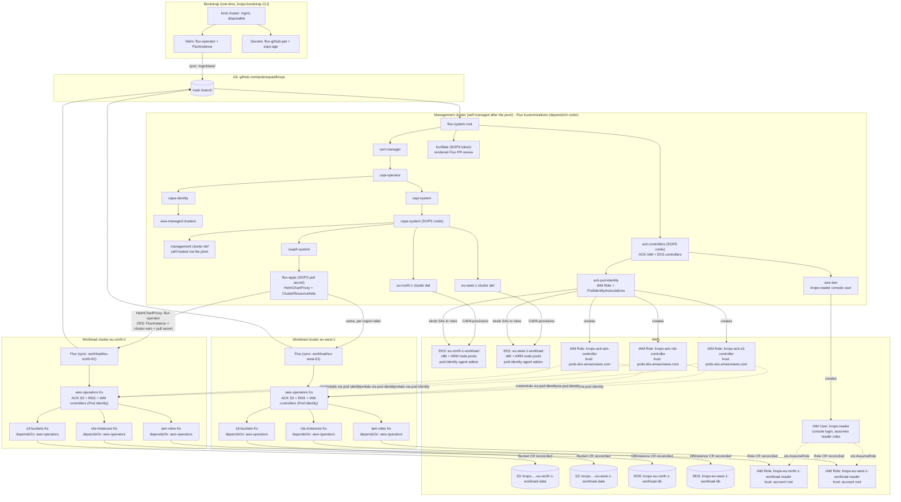

# Architecture

GitOps-driven [Cluster API](https://cluster-api.sigs.k8s.io/) (CAPI) management
platform. A disposable local [kind](https://kind.sigs.k8s.io/) cluster
bootstraps [Flux](https://fluxcd.io/), provisions the self-managed management
cluster through CAPI, and is deleted after a `clusterctl move` pivot: the
management cluster then reconciles itself and everything else from this
repository: AWS EKS workload clusters provisioned via
[CAPA](https://cluster-api-aws.sigs.k8s.io/), per-cluster Flux instances
delivered through CAPI addons, and application workloads (the
[ACK](https://aws-controllers-k8s.github.io/docs/) S3, RDS, and IAM operators
managing secure S3 buckets, PostgreSQL instances, and read-only IAM roles)
running on each workload cluster.

The operator normally runs the imperative lifecycle through the
`krops-toolbox` container. It mounts the host engine socket, joins the kind
network while the bootstrap cluster exists, and leaves no toolbox workload in
the managed clusters. This packaging changes the host tool boundary, not the
Flux or CAPI reconciliation architecture.



## Reconciliation order (management cluster)

Enforced with Flux `dependsOn`:

```
cert-manager ▶ capi-operator ▶ capi-system ▶ capa-system ▶ clusters (eu-north-1, eu-west-1)
                            │                            └▶ caaph-system ▶ flux-apps
                            └▶ capa-identity ▶ aws-managed-clusters
ack-controllers ▶ ack-pod-identity
ack-controllers ▶ aws-iam
konflate (no dependencies)
```

The `eu-north-1` cluster definitions include the management cluster itself
(`clusters/management/`): after the pivot, the management cluster's own Flux
instance reconciles the Cluster objects that define it. The bootstrap kind
cluster no longer exists at this point; nothing runs from an operator's
laptop.

## PR review: konflate

The management cluster also runs a single
[konflate](https://github.com/home-operations/konflate) instance
(`mgmt/aws/infrastructure/konflate/`), pointed at this repo
(`github://polarsquad/krops`, rendering from the repo root). It renders each
open PR at its merge-base and head and shows the diff of the *rendered* Flux
output (blast radius, image changes, render failures, and danger lint)
instead of the raw file diff. Results reach the PR two ways: a GitHub Actions
workflow (`.github/workflows/konflate.yml`) runs a one-shot konflate service
container on each PR push and gates the `konflate / Rendered Flux diff` check
on a clean render, and the in-cluster instance posts the rendered summary
comment and a `Konflate` commit status itself (write-back, outbound-only, so
the local kind cluster needs no inbound reachability from GitHub). Both upsert
the same marker-keyed comment. Full details (deployment, CI gate, tokens,
write-back, UI access): [PR review: konflate](./konflate.md).

## Reconciliation order (each workload cluster)

```
aws-operators (ACK S3 + RDS + IAM controllers) ▶ s3-buckets (Bucket CRs)
                                               ├▶ rds-instances (DBInstance CRs)
                                               └▶ iam-roles (Role CRs)
```

## How workload apps are delivered

1. Each `Cluster` in `mgmt/aws/clusters/` carries labels `fluxcd: enabled`
   and `region: <region>`.
2. `flux-apps` matches those labels: a **HelmChartProxy** installs the Flux
   Operator on every workload cluster, and per-region **ClusterResourceSets**
   apply a `FluxInstance` (syncing `workload/<region>-01/`), a `cluster-vars`
   ConfigMap (`AWS_REGION`, `CLUSTER_NAME`, `AWS_ACCOUNT_ID`, used by Flux
   `postBuild` substitution), and the Git pull secret.
3. The workload cluster's Flux reconciles `workload/`: first `aws-operators`
   (ACK S3 + RDS + IAM controllers, `wait: true`), then `s3-buckets`,
   `rds-instances`, and `iam-roles` (all `dependsOn: aws-operators`).

See [AWS authentication & IAM](./aws-iam.md) for how the ACK controllers
authenticate, and [Workload resources](./workload-resources.md) for what they
create.

## Other deployment environments

While the diagram above details the `aws` reference environment, the repository includes two other deployment targets walking the same GitOps and CAPI lifecycle:

- **`local-host`**: replaces AWS with local Docker containers (CAPD) and GitHub with a local OCI registry (`krops-registry:5000`). It provisions a one-control-plane/one-worker workload cluster and reconciles Podinfo end to end on a single host. See the architecture diagram in [docs/local-host-infra.svg](local-host-infra.svg).
- **`local-talos`**: pivots onto bare metal via Tinkerbell (CAPT) and Talos Linux (CABPT and CACPPT), syncing directly from GitHub.
- **Air-gap bundle**: packages `local-host` with Zarf for completely disconnected deployment with verified SBOMs and signed artifacts. See the air-gap architecture diagram in [docs/air-gap-infra.svg](air-gap-infra.svg) and [Air-gapped krops](./airgap.md).
