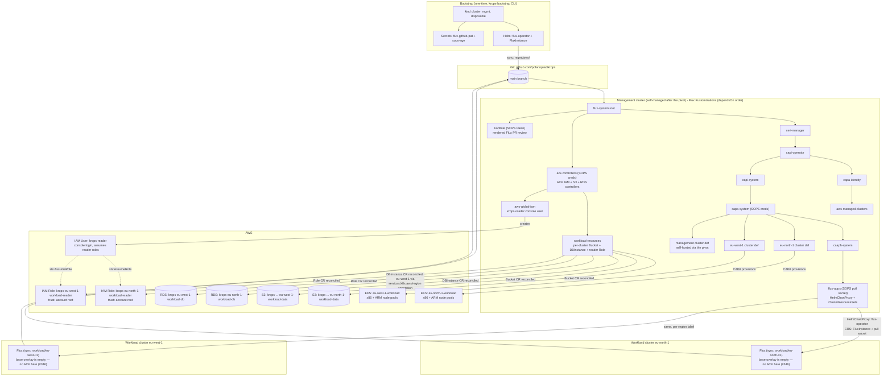
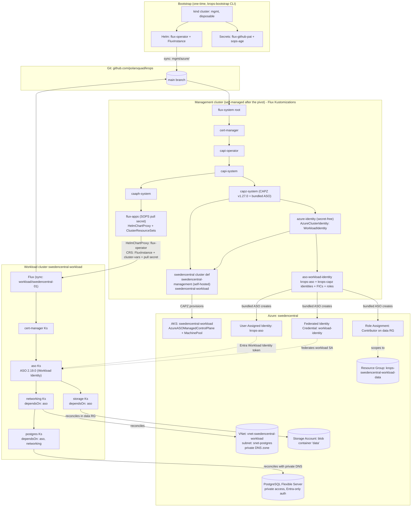
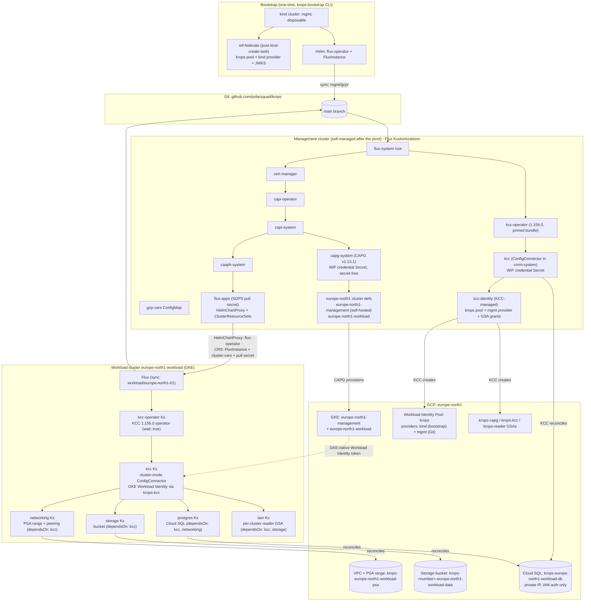
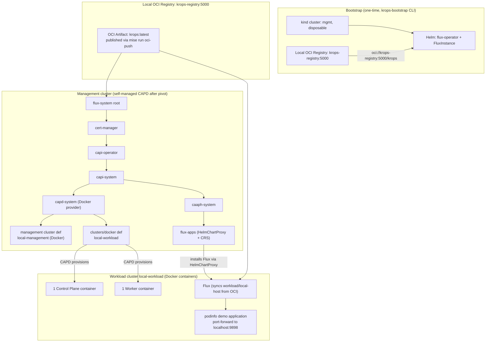
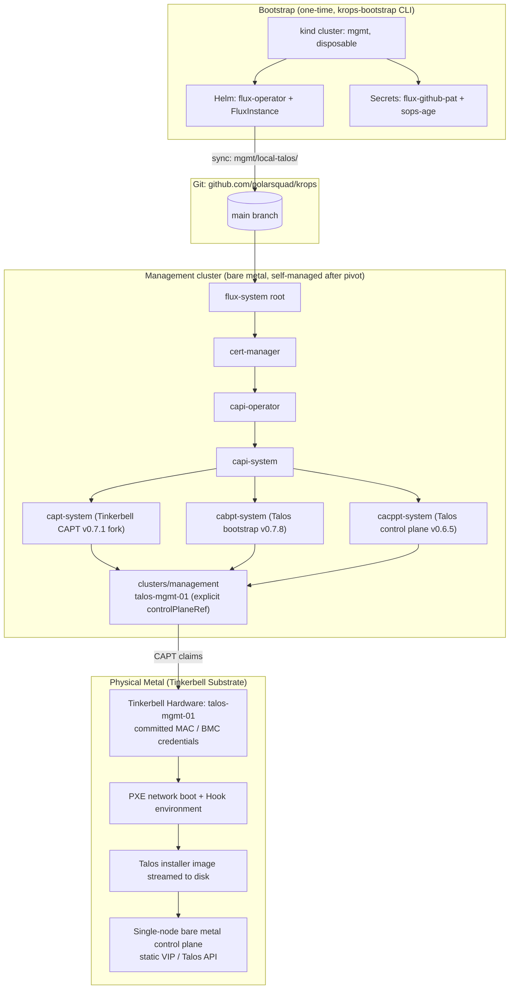

# Architecture

GitOps-driven [Cluster API](https://cluster-api.sigs.k8s.io/) (CAPI) management
platform. A disposable local [kind](https://kind.sigs.k8s.io/) cluster
bootstraps [Flux](https://fluxcd.io/), provisions the self-managed management
cluster through CAPI, and is deleted after a `clusterctl move` pivot. The
management cluster then reconciles itself and all downstream infrastructure from
this repository across multiple supported environments: AWS (`aws`), Azure
(`azure`), GCP (`gcp`), local Docker (`local-host`), bare-metal Talos
(`local-talos`), and an air-gapped bundle (`airgap`).

The operator normally runs the imperative lifecycle through the
`krops-toolbox` container. It mounts the host engine socket, joins the kind
network while the bootstrap cluster exists, and leaves no toolbox workload in
the managed clusters. This packaging changes the host tool boundary, not the
Flux or CAPI reconciliation architecture.

## AWS environment (aws)

The reference environment manages AWS infrastructure through the Kubernetes
API: CAPA provisions EKS workload clusters, CAPI addons deliver per-cluster Flux
instances, and ACK operators (S3, RDS, IAM) run once, on the management
cluster, managing cloud resources for every workload cluster directly
through the AWS API (#346).




### Reconciliation order (AWS management cluster)

Enforced with Flux `dependsOn`:

```
cert-manager ▶ capi-operator ▶ capi-system ▶ capa-system ▶ clusters (eu-north-1, eu-west-1)
                            │                            └▶ caaph-system ▶ flux-apps
                            └▶ capa-identity ▶ aws-managed-clusters
ack-controllers ▶ workload-resources
ack-controllers ▶ aws-global-iam
konflate (no dependencies)
```

The `eu-north-1` cluster definitions include the management cluster itself
(`clusters/management/`): after the pivot, the management cluster's own Flux
instance reconciles the Cluster objects that define it. The bootstrap kind
cluster no longer exists at this point; nothing runs from an operator's
laptop.

### PR review: konflate

The management cluster also runs a single
[konflate](https://github.com/home-operations/konflate) instance
(`mgmt/aws/infrastructure/konflate/`), pointed at this repo
(`github://polarsquad/krops`, rendering from the repo root). It renders each
open PR at its merge-base and head and shows the diff of the *rendered* Flux
output (blast radius, image changes, render failures, and danger lint)
instead of the raw file diff. Results reach the PR two ways: a GitHub Actions
workflow (`.github/workflows/konflate.yml`) runs a one-shot konflate service
container on each PR push and gates the `konflate / Rendered Flux diff` check
on a clean render, and the in-cluster instance posts the rendered summary
comment and a `Konflate` commit status itself (write-back, outbound-only, so
the local kind cluster needs no inbound reachability from GitHub). Both upsert
the same marker-keyed comment. Full details (deployment, CI gate, tokens,
write-back, UI access): [PR review: konflate](./konflate.md).

### Reconciliation order (AWS workload clusters)

None: since #346, ACK's S3, RDS, and IAM controllers run only on the
management cluster (`workload-resources`, above) and manage every workload
cluster's resources directly. `workload/base/` is an empty overlay — each
workload cluster still runs its own Flux instance, ready for a future
application workload (see the local-host Podinfo pattern), but reconciles
nothing today.

### How workload apps are delivered (AWS)

1. Each `Cluster` in `mgmt/aws/clusters/` carries labels `fluxcd: enabled`
   and `region: <region>`.
2. `flux-apps` matches those labels: a **HelmChartProxy** installs the Flux
   Operator on every workload cluster, and per-region **ClusterResourceSets**
   apply a `FluxInstance` (syncing `workload/<region>-01/`) and the Git pull
   secret.
3. The workload cluster's Flux reconciles `workload/`, which resolves to the
   empty `workload/base/` overlay today.

AWS resource provisioning (S3, RDS, IAM) happens on the management cluster,
not on the workload clusters — see
[AWS authentication & IAM](./aws-iam.md) for how the ACK controllers
authenticate, and [Workload resources](./workload-resources.md) for what they
create.

## Azure environment (azure)

The `azure` environment mirrors `aws`: a disposable kind cluster bootstraps
Flux, CAPZ v1.27.0 provisions an AKS management cluster (`swedencentral-management`),
the pivot moves the management objects into it, and each AKS workload cluster
runs its own Azure Service Operator (ASO 2.19.0) reconciling Azure resources from
`workload/azure-base/`.

No Azure secret exists at rest: the management cluster authenticates CAPZ and
the bundled ASO with workload identity against the `krops-capz`
User-Assigned Identity (federated to the kind cluster's Arc OIDC issuer at
bootstrap, and to the management cluster's own OIDC issuer post-pivot), while
workload clusters hold no credentials at all. The bundled ASO on the
management cluster reconciles identity resources (`krops-aso` and `krops-capz`
identities, resource group role assignments, and Federated Identity
Credentials), enabling the workload ASO to authenticate with Entra ID
Workload Identity.

See the architecture diagram in [docs/azure-infra.svg](azure-infra.svg) and
the [Azure environment guide](./azure.md).




### Reconciliation order (Azure management cluster)

```
cert-manager ▶ capi-operator ▶ capi-system ▶ capz-system (bundled ASO)
                                           ├▶ azure-identity ▶ aso-workload-identity
                                           ├▶ clusters (swedencentral)
                                           └▶ caaph-system ▶ flux-apps
```

### Reconciliation order (Azure workload cluster)

```
cert-manager ▶ aso (ASO 2.19.0 via Workload Identity) ▶ networking (VNet + delegated subnet + DNS)
                                                      ├▶ storage (Storage Account + blob container)
                                                      └▶ postgres (dependsOn: aso, networking)
```

## GCP environment (gcp)

The `gcp` environment mirrors `azure`: a disposable kind cluster bootstraps
Flux, CAPG v1.13.1 provisions a GKE management cluster
(`europe-north1-management`), the pivot moves the management objects into
it, and the GKE workload cluster runs its own Config Connector (KCC 1.156.0)
reconciling GCP resources from `workload/gcp-base/`.

No GCP secret exists at rest. CAPG and the management-side Config Connector
authenticate with Workload Identity Federation against the `krops` pool:
their service accounts present the cluster's projected token through the
`kind` provider at bootstrap and the Git-declared `mgmt` provider
post-pivot, and the credential files are plain `external_account` Secrets
with a subject condition restricted to exactly those two service accounts
(`krops-capg` is the GSA they impersonate). The workload cluster uses
GKE-native Workload Identity through `krops-kcc`. The pivot applies the two
credential Secrets to the target before `clusterctl move`
(`pivot-manifests`) and pins `GCP_WIF_PROVIDER=mgmt`
(`pivot-manifest-vars`), because the source-side ConfigMap merge order
cannot guarantee it.

See the architecture diagram in [docs/gcp-infra.svg](gcp-infra.svg) and the
[GCP environment guide](./gcp.md).




### Reconciliation order (GCP management cluster)

```
gcp-vars ▶ cert-manager ▶ capi-operator ▶ capi-system ▶ capg-system (GCPManaged* CRDs)
                                                        ├▶ caaph-system ▶ flux-apps
gcp-vars ▶ kcc-operator (StatefulSet Ready) ▶ kcc (cnrm-system) ▶ kcc-identity (krops pool, mgmt provider)
europe-north1 clusters (dependsOn: capg-system, gcp-vars)
```

### Reconciliation order (GCP workload cluster)

```
kcc-operator (operator StatefulSet Ready; the pinned bundle ships its own
webhook certs, so no cert-manager) ▶ kcc (ConfigConnector, no wait: the CR
has no standard ready condition)
                                     ├▶ networking (PSA range + peering)
                                     ├▶ storage (bucket)
                                     ├▶ postgres (Cloud SQL, dependsOn: networking)
                                     └▶ iam (per-cluster reader GSA, dependsOn: storage)
```

## Local host environment (local-host)

The `local-host` environment replaces AWS with local Docker containers (CAPD)
and GitHub with a local in-memory OCI registry (`krops-registry:5000`). It
provisions a one-control-plane/one-worker workload cluster and reconciles the
Podinfo demo application end to end on a single host.

See the architecture diagram in [docs/local-host-infra.svg](local-host-infra.svg).




### Reconciliation order (local-host)

Management cluster:
```
cert-manager ▶ capi-operator ▶ capi-system ▶ capd-system ▶ clusters (local-management, local-workload)
                            │                            └▶ caaph-system ▶ cni ▶ flux-apps
```

Workload cluster:
```
podinfo (HelmRelease reconciled by local workload Flux from OCI artifact)
```

## Bare-metal Talos environment (local-talos)

The `local-talos` environment targets physical bare metal: a disposable kind
cluster installs CAPI with the Tinkerbell infrastructure provider (CAPT pinned
to fork v0.7.1) and Talos bootstrap/control-plane providers (CABPT v0.7.8,
CACPPT v0.6.5). The controllers match a committed Tinkerbell Hardware object
(`talos-mgmt-01`), PXE-boot the target machine, write the Talos installer
image to disk, and bring up an immutable single-node control plane.

Scope fence: `local-talos` is management-only. It owns no workload clusters and
deploys no CAPI addons (Talos ships its own internal CNI). Teardown deletes the
CAPI objects so CAPT releases the Hardware back to the Tinkerbell pool; the
physical machine is never wiped or reclaimed.

See the architecture diagram in [docs/local-talos-infra.svg](local-talos-infra.svg).




### Reconciliation order (local-talos)

```
cert-manager ▶ capi-operator ▶ capi-system ▶ capt-system (Tinkerbell CAPT) ──┐
                                           ├▶ cabpt-system (Talos bootstrap) ─┼▶ clusters/management (talos-mgmt-01)
                                           └▶ cacppt-system (Talos CP) ───────┘
```

## Air-gapped bundle (airgap)

The air-gap bundle packages the `local-host` profile with [Zarf](https://zarf.dev)
for completely disconnected deployments. A connected build machine renders the
krops GitOps tree, pulls required container images and charts, generates Syft
SBOMs, and signs the resulting package. On the disconnected deploy host, Zarf
initializes an internal container registry and proxy agent that rewrites image
pulls, while Flux reconciles the offline management and workload clusters with zero
external network traffic.

See the architecture diagram in [docs/air-gap-infra.svg](air-gap-infra.svg) and
the [Air-gapped krops guide](./airgap.md).


