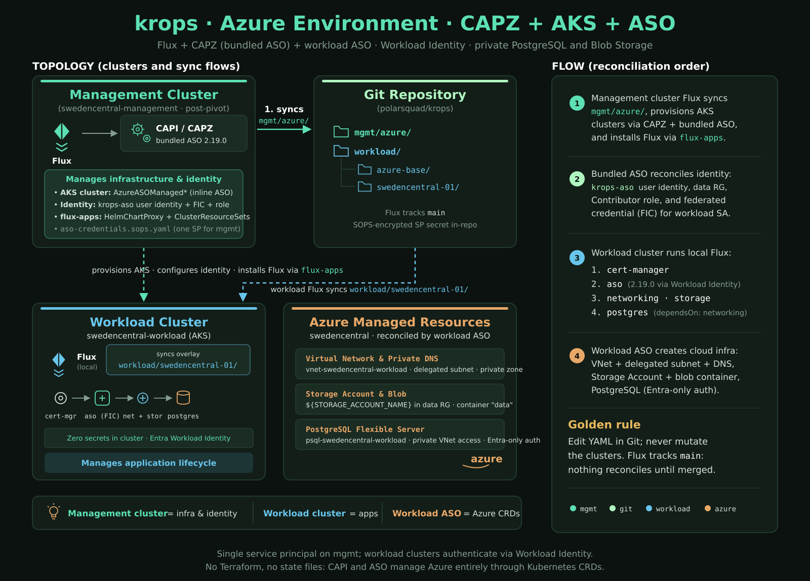

# Azure environment

The `azure` environment mirrors `aws`: a kind bootstrap cluster runs Flux,
CAPZ builds an AKS management cluster, the pivot moves the management
objects into it, and each AKS workload cluster runs its own Azure Service
Operator (ASO) that reconciles Azure resources from `workload/azure-base/`.

| AWS (`aws`) | Azure (`azure`) |
|---|---|
| CAPA, `AWSManagedControlPlane` | CAPZ v1.27.0, `AzureASOManagedControlPlane` (AKS via inline ASO resources) |
| ACK controllers on workload clusters | ASO 2.19.0 Helm release on workload clusters |
| EKS Pod Identity (ACK IAM + EKS controllers on mgmt) | Workload identity: user-assigned identity + federated credential + role assignment, reconciled by the ASO bundled with CAPZ on mgmt |
| S3 bucket | Storage account + blob container |
| RDS PostgreSQL | PostgreSQL Flexible Server (private access, Entra-only auth) |
| IAM reader role | none yet (follow-up) |



## Prerequisites

- An Azure subscription where you hold Owner (needed once, for
  `azure-bootstrap`).
- `mise -E azure install` (adds `az`), a GitHub PAT and an age key as for
  `aws` (`.env`, see [operations.md](./operations.md)).
- Resource providers, the service principal, the shared resource group and
  the `krops-aso` identity are created by:

  ```sh
  export AZURE_SUBSCRIPTION_ID=<id>
  mise -E azure run azure-bootstrap
  ```

  It prints the values to commit and the service-principal secret once.

## Commit the identifiers

1. `mgmt/azure/infrastructure/azure-identity/azure-vars.yaml`:
   `AZURE_SUBSCRIPTION_ID`, `AZURE_TENANT_ID`, `AZURE_CLIENT_ID` (the SP
   app ID).
2. `mgmt/azure/addons/flux-apps/flux-instance.yaml` (`cluster-vars`):
   the same two IDs plus `AZURE_ASO_CLIENT_ID`, `AZURE_ASO_PRINCIPAL_ID`
   (the `krops-aso` identity) and `STORAGE_ACCOUNT_NAME` (globally unique,
   3-24 lowercase alphanumerics; change it if creation fails with
   `StorageAccountAlreadyTaken`).
3. Pick the AKS version: `az aks get-versions --location swedencentral -o table`
   and set `version:` in `mgmt/azure/clusters/swedencentral/*/cluster.yaml`
   (control plane and every MachinePool).

## Credentials

One service principal serves CAPZ (`AzureClusterIdentity` in
`azure-identity/cluster-identity.yaml`) and the bundled ASO
(`serviceoperator.azure.com/credential-from: aso-credentials` on every
management-side ASO resource). It lives SOPS-encrypted in
`mgmt/azure/infrastructure/azure-identity/aso-credentials.sops.yaml`:

```sh
mise run sops-decrypt mgmt/azure/infrastructure/azure-identity/aso-credentials.sops.yaml > /tmp/aso.yaml
# set stringData.AZURE_SUBSCRIPTION_ID / AZURE_TENANT_ID / AZURE_CLIENT_ID / AZURE_CLIENT_SECRET
mv /tmp/aso.yaml mgmt/azure/infrastructure/azure-identity/aso-credentials.sops.yaml
mise run sops-encrypt mgmt/azure/infrastructure/azure-identity/aso-credentials.sops.yaml
```

Workload clusters hold no Azure secret: their ASO authenticates with
workload identity through the federated credential in
`mgmt/azure/infrastructure/aso-workload-identity/`.

## Bootstrap, pivot, teardown

```sh
mise -E azure run bootstrap        # kind + Flux + CAPZ; then pivot into swedencentral-management
mise -E azure run mgmt-kubeconfig  # ~/.kube/krops-mgmt.yaml
mise -E azure run kubeconfigs      # workload kubeconfigs via clusterctl
```

During the pivot the CLI decrypts `aso-credentials.sops.yaml` with your age
key and applies it to the target before `clusterctl move`
(`pivot-sops-secrets` in `bootstrap.toml`): the moved ASO resources
reference the Secret by name and clusterctl does not carry it.

Teardown is manual for now: `mise -E azure run teardown` refuses and prints
the steps (`teardown.manual` in `bootstrap.toml`). Automating the Azure
orphan sweep is tracked in the follow-up issue linked from #71.

## Reconciliation order

Management cluster: cert-manager, capi-operator, capi-system, capz-system
(health check waits for the CAPZ and the additional ASO CRDs),
azure-identity, aso-workload-identity, swedencentral (clusters), flux-apps.
`azure-identity` substitutes from the `azure-vars` ConfigMap it creates
itself, so its first reconcile fails once and succeeds on the 2-minute
retry.

Workload cluster: cert-manager, aso, then networking, storage, and
postgres (postgres depends on networking).

## Upgrading CAPZ and ASO

CAPZ bundles a specific ASO version and ASO only supports upgrades one
minor version at a time. Renovate proposes CAPZ minors one at a time
(`separateMultipleMinor`); merge and let the management cluster settle
before the next. Keep the workload ASO chart (`workload/azure-base/aso/helm.yaml`)
within one minor of the management-side bundle.

## Known limitations

- No live acceptance run has been performed yet (no subscription at
  implementation time); placeholders are listed above.
- No GPU node pool: GPU quota is 0 on new subscriptions.
- No reader identity (the `krops-reader` IAM counterpart).
- The Flexible Server's only administrator is the `krops-aso` identity;
  grant humans through `FlexibleServersAdministrator` resources.
