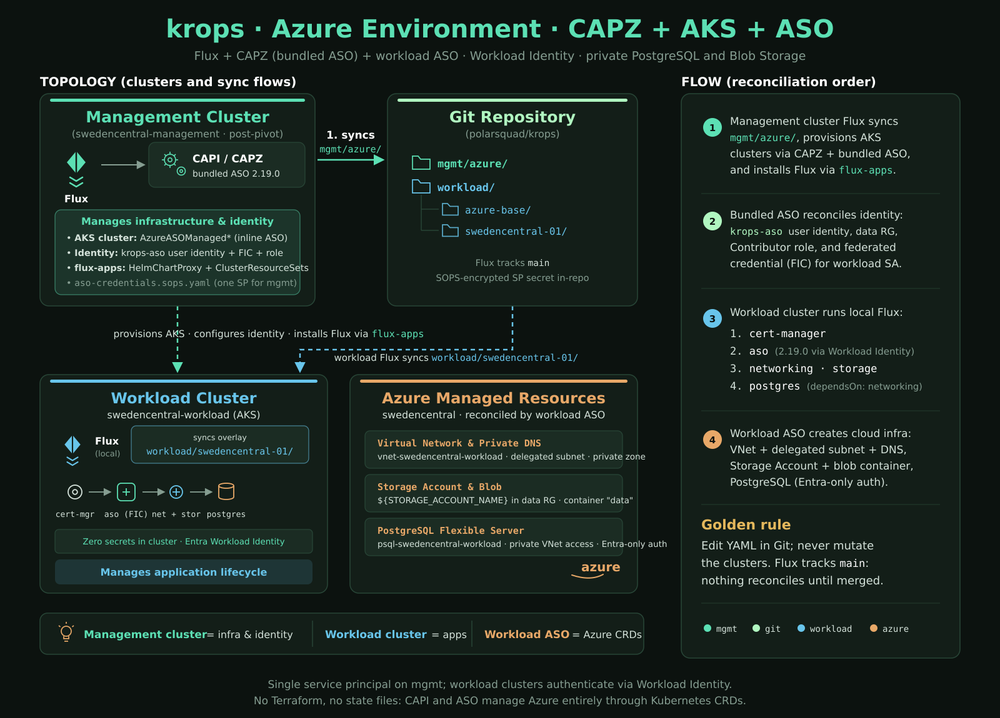

# Azure environment

The `azure` environment mirrors `aws`: a kind bootstrap cluster runs Flux,
CAPZ builds an AKS management cluster, the pivot moves the management
objects into it, and the management cluster's ASO (bundled with CAPZ)
reconciles the workload Azure resources from
`mgmt/azure/infrastructure/workload-resources/`.

| AWS (`aws`) | Azure (`azure`) |
|---|---|
| CAPA, `AWSManagedControlPlane` | CAPZ v1.27.0, `AzureASOManagedControlPlane` (AKS via inline ASO resources) |
| ACK controllers on the management cluster only (issue #346) | ASO bundled by CAPZ on the management cluster only (workload release removed, issue #559) |
| Static SOPS credentials on the management cluster (no EKS Pod Identity since issue #346) | Workload identity: user-assigned identity + federated credential + role assignment, reconciled by the ASO bundled with CAPZ on mgmt |
| S3 bucket | Storage account + blob container |
| RDS PostgreSQL | PostgreSQL Flexible Server (private access, Entra-only auth) |
| IAM reader role | none yet (follow-up) |



## Prerequisites

- An Azure subscription where you hold Owner (needed once, for
  `azure-bootstrap`).
- A GitHub PAT and an age key as for `aws` (`.env`, see
  [operations.md](./operations.md)). No host toolchain: `az` is in the
  toolbox image.
- Resource providers (including the Arc ones), the shared resource group and
  the `krops-capz` user-assigned identity with its role grants are created
  by `azure-bootstrap`. Log in first with the device-code
  flow; the session persists in a host directory mounted as `/root/.azure`
  (keep it outside the checkout or gitignore it):

  ```sh
  export AZURE_SUBSCRIPTION_ID=<id>
  mkdir -p "$HOME/.krops-azure"
  docker run --rm -it -v "$HOME/.krops-azure:/root/.azure" \
    --entrypoint az "$TOOLBOX_IMAGE" login --use-device-code
  docker run --rm -it -v "$PWD:/workspace" -w /workspace \
    -v "$HOME/.krops-azure:/root/.azure" \
    -e AZURE_SUBSCRIPTION_ID -e MISE_AUTO_INSTALL=0 \
    --entrypoint mise "$TOOLBOX_IMAGE" -E azure run azure-bootstrap
  ```

  It prints the values to commit; nothing it prints is secret (there is no
  service principal).

## Commit the identifiers

1. `mgmt/azure/infrastructure/azure-identity/azure-vars.yaml`:
   `AZURE_SUBSCRIPTION_ID`, `AZURE_TENANT_ID`, `AZURE_CLIENT_ID` (the
   `krops-capz` UAMI client ID), and `AZURE_CAPZ_PRINCIPAL_ID` (the
   `krops-capz` UAMI principal ID, substituted for the
   `FlexibleServersAdministrator` `azureName`).
2. `mgmt/azure/addons/flux-apps/regions/swedencentral/cluster-vars.yaml`:
   the same two IDs plus `STORAGE_ACCOUNT_NAME` (globally unique,
   3-24 lowercase alphanumerics; change it if creation fails with
   `StorageAccountAlreadyTaken`).
3. Pick the AKS version: `az aks get-versions --location swedencentral -o table`
   and set `version:` in `mgmt/azure/clusters/swedencentral/*/cluster.yaml`
   (control plane and every MachinePool).

## Credentials

No Azure secret exists at rest. CAPZ and the bundled ASO authenticate with
workload identity against the `krops-capz` UAMI (`AzureClusterIdentity` with
`type: WorkloadIdentity`, and the bundled ASO's
`serviceoperator.azure.com/credential-from: aso-credentials` annotation, a
plain Secret); in kind the token issuer is the Arc-hosted OIDC issuer (the
`arc-federate` mise task, run by bootstrap-rs as `post-kind-create-task`),
post-pivot it is the management cluster's own OIDC issuer. The workload
Azure resources (VNet, storage account, PostgreSQL Flexible Server)
reconcile on the management cluster through the same `aso-credentials`
Secret (the `krops-capz` principal has subscription scope, which covers the
per-cluster data resource group). Workload clusters hold no Azure
credentials at all.

## Bootstrap, pivot, teardown

```sh
scripts/toolbox-run.sh bootstrap azure   # kind + Flux + CAPZ; then pivot into swedencentral-management
export KUBECONFIG="$PWD/.kube/krops-mgmt.yaml"   # written by the pivot, context krops-mgmt
docker run --rm -it \
  -v "$PWD:/workspace" -w /workspace \
  -v "$PWD/.kube:/root/.kube" \
  -e KUBECONFIG=/workspace/.kube/krops-mgmt.yaml -e KUBECONFIG_FILE=/root/.kube/krops-workloads.yaml \
  -e MISE_AUTO_INSTALL=0 \
  --entrypoint mise "$TOOLBOX_IMAGE" -E azure run kubeconfigs   # via clusterctl; writes .kube/krops-workloads.yaml.<cluster>
```

`arc-federate` runs inside the toolbox as the `post-kind-create-task` and
needs the `az` session. `scripts/toolbox-run.sh` automatically creates and mounts
`$HOME/.krops-azure` at the effective `AZURE_CONFIG_DIR` inside the container
(default `/root/.azure`). Set a different container path in `.env` if needed;
`.env` takes precedence over the shell. It reuses the preparation session, or
starts device-code login if no session exists, before selecting the subscription.
For a raw lifecycle run, mount the same cache at the container config path.
To debug it by hand, use the cluster run shape from
[Helper tasks in the toolbox](./operations.md#helper-tasks-in-the-toolbox)
with `--network kind -e KUBECONFIG=/workspace/.kube/kind.yaml
-v "$HOME/.krops-azure:/root/.azure"` and `-E azure run arc-federate`.

Right after the kind cluster is created, bootstrap-rs runs the `arc-federate`
mise task (`post-kind-create-task` in `bootstrap.toml`): it Arc-connects the
kind cluster with an OIDC issuer, patches the kind apiserver to mint tokens
with that issuer, and creates the two kind-issuer federated credentials for
CAPZ and ASO.

During the pivot the CLI applies the plain, secret-free
`aso-credentials` Secret to the target before `clusterctl move`
(`pivot-manifests` in `bootstrap.toml`): the moved ASO resources reference
the Secret by name and clusterctl does not carry it.

Teardown is manual for now: `scripts/toolbox-run.sh teardown azure` refuses
and prints
the steps (`teardown.manual` in `bootstrap.toml`), including deleting the Arc
resource (`az connectedk8s delete`). Automating the Azure orphan sweep is
tracked in the follow-up issue linked from #71.

## Reconciliation order

Management cluster: cert-manager, capi-operator, capi-system, capz-system
(health check waits for the CAPZ and the additional ASO CRDs),
azure-identity, aso-workload-identity, workload-resources, swedencentral
(clusters), flux-apps.
`azure-identity` substitutes from the `azure-vars` ConfigMap it creates
itself, so its first reconcile fails once and succeeds on the 2-minute
retry.

Workload cluster: cert-manager only (the Azure resources moved to the
management cluster in issue #559).

## Upgrading CAPZ and ASO

CAPZ bundles a specific ASO version and ASO only supports upgrades one
minor version at a time. Renovate proposes CAPZ minors one at a time
(`separateMultipleMinor`); merge and let the management cluster settle
before the next.

## Known limitations

- No live acceptance run has been performed yet (no subscription at
  implementation time); placeholders are listed above.
- The Arc resource uuid (and therefore the issuer URL) changes if the Arc
  resource is deleted and recreated; the kind-issuer FICs are upserted by
  `arc-federate` on the next bootstrap, so this self-heals. The
  `connectedk8s` az extension version is pinned in `mise.azure.toml` but not
  covered by Renovate.
- No GPU node pool: GPU quota is 0 on new subscriptions.
- No reader identity (the `krops-reader` IAM counterpart).
- The Flexible Server's only administrator is the `krops-capz` identity;
  grant humans through `FlexibleServersAdministrator` resources.
