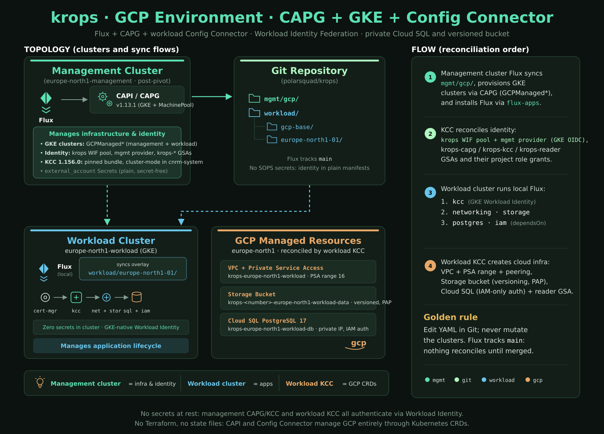

# GCP environment

The `gcp` environment mirrors `azure`: a kind bootstrap cluster runs Flux,
CAPG builds a GKE management cluster, the pivot moves the management objects
into it, and the GKE workload cluster runs its own Config Connector (KCC)
that reconciles GCP resources from `workload/gcp-base/`.

| AWS (`aws`) | Azure (`azure`) | GCP (`gcp`) |
|---|---|---|
| CAPA, `AWSManagedControlPlane` | CAPZ, `AzureASOManagedControlPlane` | CAPG v1.13.1, `GCPManagedControlPlane` (GKE) |
| ACK controllers on the management cluster only (issue #346) | ASO 2.19.0 Helm release | Config Connector (KCC 1.156.0) Helm release |
| Static SOPS credentials on the management cluster (no EKS Pod Identity since issue #346) | Entra Workload Identity | Workload Identity Federation (WIF pool `krops`) |
| S3 bucket | Storage account + blob container | Storage bucket (versioning, uniform access, PAP) |
| RDS PostgreSQL | PostgreSQL Flexible Server | Cloud SQL (private IP, IAM auth) |
| IAM reader role | none yet (follow-up) | `krops-reader` GSA + per-cluster reader GSA |



## Prerequisites

- A GCP project with a billing account where you hold Owner (needed once,
  for `gcp-bootstrap`).
- `mise -E gcp install` (adds `gcloud` 585.0.0), then
  `gcloud components install gke-gcloud-auth-plugin` once (it is not in the
  SDK tarball; the toolbox image runs this in its build, so `wif-federate`
  and the GKE kubeconfig already have it), plus a GitHub PAT and an age key
  as for `aws` (`.env`, see [operations.md](./operations.md)), and
  `GCP_PROJECT` set.
- `gcloud auth login` (browser or
  `gcloud auth login --no-launch-browser`); the session is shared with the
  toolbox through the gitignored `.gcloud/` directory (`CLOUDSDK_CONFIG`).
- The one-time project preparation (enable the GKE/SQL/Storage/IAM/STS APIs,
  create the `krops-capg` / `krops-kcc` / `krops-reader` service accounts
  with their project role grants, and create the `krops` workload identity
  pool):

  ```sh
  export GCP_PROJECT=<project-id>
  mise -E gcp run gcp-bootstrap
  ```

  It prints the values to commit; nothing it prints is secret (no service
  account key is ever created, issue #72).

## Commit the identifiers

1. `mgmt/gcp/infrastructure/gcp-vars/gcp-vars.yaml`: `GCP_PROJECT`,
   `GCP_PROJECT_NUMBER` (printed by `gcp-bootstrap`). The region (`europe-north1`)
   and zone (`europe-north1-a`) are committed constants.
2. `mgmt/gcp/addons/flux-apps/flux-instance.yaml` (`cluster-vars`): the same
   `GCP_PROJECT` / `GCP_PROJECT_NUMBER` for the workload cluster.
3. Pick the GKE version: `gcloud container get-server-config --zone europe-north1-a`
   and set `version:` in
   `mgmt/gcp/clusters/europe-north1/{management,staging}/cluster.yaml`
   (control plane and every machine pool).

## Credentials

No GCP secret exists at rest. CAPG and the management-side Config Connector
authenticate through Workload Identity Federation: their service accounts
(`capg-system/capg-manager`, `cnrm-system/cnrm-controller-manager`) present
the cluster's projected token to the `krops` pool, and the
`external_account` JSON files in
`mgmt/gcp/capi-providers/capg-system/capg-wif-credentials.yaml` and
`mgmt/gcp/infrastructure/kcc/kcc-wif-credentials.yaml` (plain Secrets, not
keys) point at pool `krops`, provider `${GCP_WIF_PROVIDER:=mgmt}`, subject
restricted by `attributeCondition` to exactly those two service accounts.

- On the kind bootstrap cluster the provider is `kind`: the `wif-federate`
  mise task (run by bootstrap-rs as `post-kind-create-task`) uploads the
  kind cluster's OIDC JWKS as the pool's `kind` provider, grants
  `roles/iam.workloadIdentityUser` on `krops-capg` to both service-account
  subjects, and sets `GCP_WIF_PROVIDER=kind` in a `gcp-wif` ConfigMap that
  Flux substitution reads after `gcp-vars`.
- Post-pivot the provider is `mgmt`, declared in Git at
  `mgmt/gcp/infrastructure/kcc-identity/` (KCC-managed
  `IAMWorkloadIdentityPoolProvider` with the management cluster's OIDC
  issuer, `allowedAudiences` equal to the issuer). The pivot pins
  `GCP_WIF_PROVIDER=mgmt` through `pivot-manifest-vars` in `bootstrap.toml`
  because the source-side ConfigMap merge order cannot guarantee it.
- The workload cluster uses GKE-native Workload Identity: the management
  cluster's KCC grants `roles/iam.workloadIdentityUser` on `krops-kcc` to
  the workload cluster's `cnrm-controller-manager`
  (`mgmt/gcp/infrastructure/kcc-identity/europe-north1-workload.yaml`), and
  its `ConfigConnector` uses `googleServiceAccount: krops-kcc` directly.

## Bootstrap, pivot, teardown

```sh
mise -E gcp run bootstrap        # kind + Flux + CAPG; then pivot into europe-north1-management
mise run mgmt-kubeconfig         # ~/.kube/krops-mgmt.yaml (mgmt-kubeconfig in mise.toml)
mise -E gcp run kubeconfigs      # workload kubeconfigs (user kubeconfig Secrets)
```

Right after the kind cluster is created, bootstrap-rs runs the
`wif-federate` mise task (`post-kind-create-task` in `bootstrap.toml`):
it registers the kind cluster's OIDC provider and the two impersonation
bindings on `krops-capg`, and creates the `gcp-wif` ConfigMap. A recreated
kind cluster (new signing key) is healed by the JWKS re-upload on the next
run.

During the pivot the CLI applies the plain, secret-free WIF credential
Secrets and the `cnrm-system` namespace to the target before
`clusterctl move` (`pivot-manifests` in `bootstrap.toml`), with
`GCP_WIF_PROVIDER` forced to `mgmt` (`pivot-manifests` +
`pivot-manifest-vars`): the moved provider and Config Connector reference
the Secrets by name and clusterctl does not carry them.

Teardown is manual for now: `mise -E gcp run teardown` refuses and prints
the steps (`teardown.manual` in `bootstrap.toml`). The `krops` pool, its
providers and the service accounts are deliberately left in place; they are
re-adopted on the next bootstrap.

## Reconciliation order

Management cluster: `gcp-vars` (the non-secret identifiers ConfigMap),
cert-manager, capi-operator, capi-system, capg-system (health checks wait
for the GCPManaged* CRDs), caaph-system, kcc-operator (waits for the
operator StatefulSet), kcc (the `cnrm-system` ConfigConnector), kcc-identity
(the `krops` pool, `mgmt` provider and GSA grants, managed by KCC),
europe-north1 (clusters), flux-apps. The `kcc` and `capg-system`
Kustomizations substitute from `gcp-vars` plus the optional `gcp-wif`
ConfigMap, so their first reconcile on a fresh source can fail once and
succeeds on the 2-minute retry.

Workload cluster: kcc-operator (the operator, waited on; the pinned
bundle ships its own webhook certs, so no cert-manager), kcc (the
cluster-mode ConfigConnector), then networking (Private Service Access),
storage (bucket), postgres (Cloud SQL, depends on networking) and iam
(per-cluster reader).

## Upgrading CAPG and the Config Connector operator

CAPG minors: merge one at a time and let the management cluster settle
before the next (GKE and MachinePool are feature-gated, see
`capi-providers/capg-system/capg-variables.yaml`).

The Config Connector operator is a pinned, verbatim release bundle
(`mgmt/gcp/infrastructure/kcc-operator/configconnector-operator.yaml`,
version comment `kcc-operator-version:`). Renovate bumps the version
comment and the operator image tag, but it does not rewrite the ~3500-line
manifest: `tests/test-kcc-operator-pin.py` (in `mise run validate`) then
goes red on purpose. Complete the bump by hand: download the new
`release-bundle.tar.gz`, replace the file, and commit (both the management
and the workload copies must stay byte-identical).

## Known limitations

- No live acceptance run has been performed yet (no project at
  implementation time); the project number is a placeholder until
  `gcp-bootstrap` runs.
- Zonal clusters (`europe-north1-a`) until multi-zone availability in the
  project is confirmed (spike S4 of the implementation plan).
- Cloud SQL instance names have a reuse cooldown after deletion; a
  teardown-then-bootstrap on the same project can race it.
- No Arm machine pool yet (machine-type availability in `europe-north1-a`
  unverified); the x86 pool is the default.
- The `kind` WIF provider stays in the pool after the pivot; it is harmless
  (its subject condition matches only the kind cluster's service accounts)
  and keeps re-bootstrap of a kind cluster cheap.
- GKE Autopilot, GPU pools and the per-cluster reader's
  `iam.serviceAccountTokenCreator` grant are follow-ups, not part of this
  PR.
