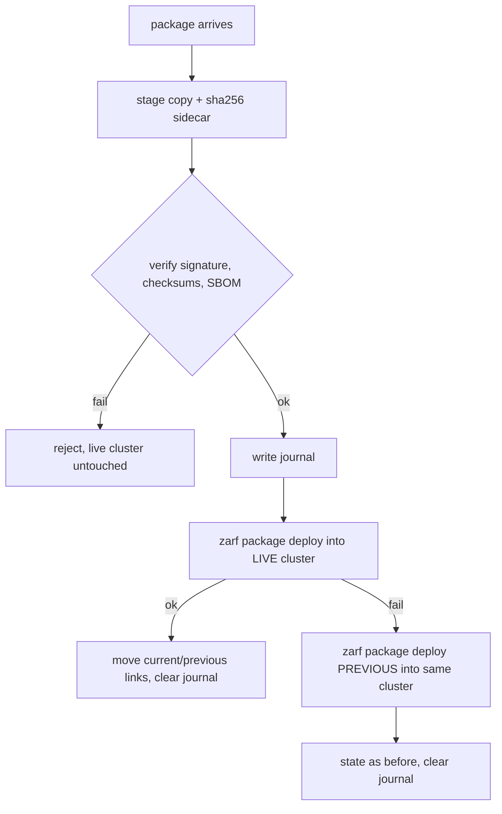
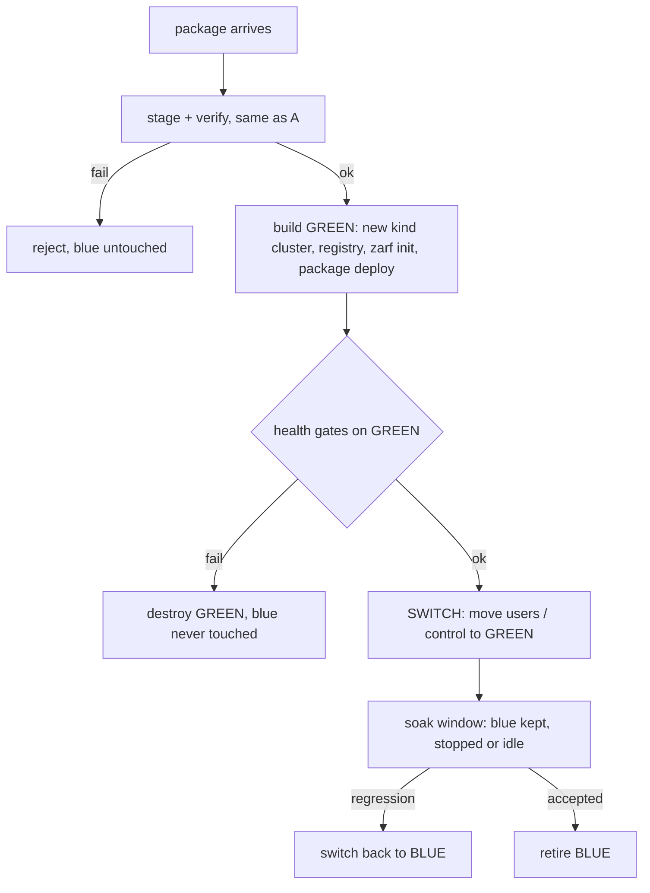
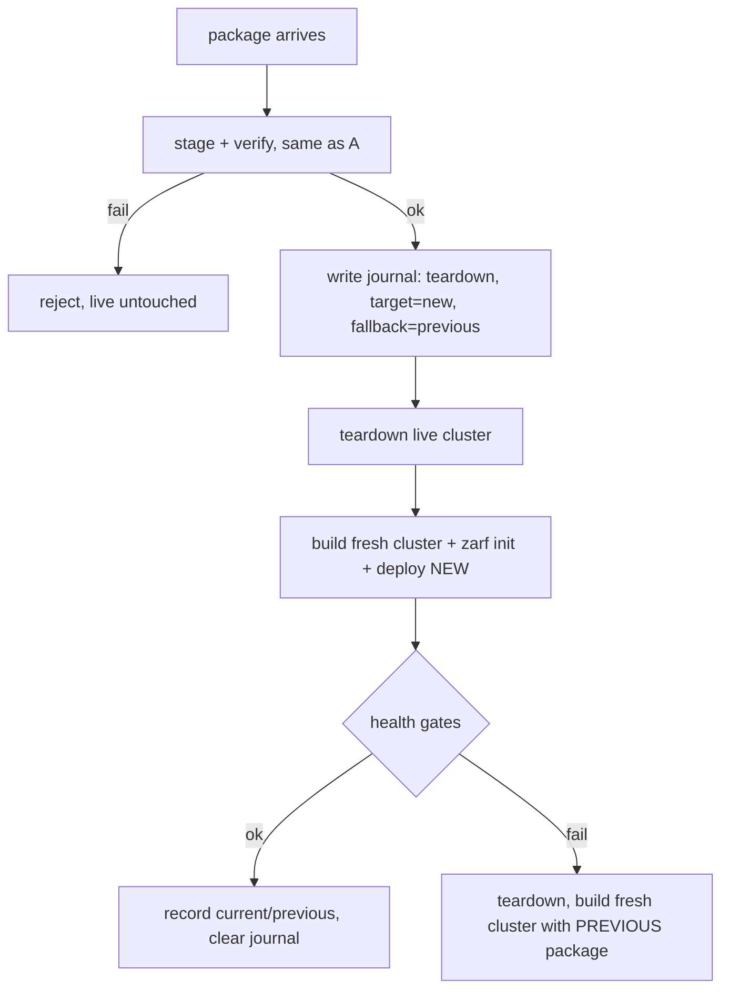

# Air-gap bundle update: in-place vs side-by-side vs recreate

- Status: draft, for review
- Tracking issue: [#369](https://github.com/polarsquad/krops/issues/369) (parent [#80](https://github.com/polarsquad/krops/issues/80))

Design comparison for issue #369 (transactional bundle update with tested
offline rollback, parent #80). It compares three architectures against the
failure cases that matter today, and proposes a controller design for each.
Nothing here is decided; the last section lists what needs a decision.

## Names

- **In-place update** (also "upgrade in place"): the new package is deployed
  into the running cluster.
- **Side-by-side update**: the new package is deployed into a second, fresh
  cluster next to the running one. The industry name is **blue/green
  deployment**: blue is the live environment, green is the candidate; traffic
  or users move from blue to green once green is proven, and blue is retired.
  Related names: "parallel run", "immutable replace".
- **Recreate** (also "teardown and redeploy"): destroy the live environment,
  then build the new one from scratch. Same name as the Kubernetes Deployment
  strategy. Canary and rolling
  updates are not relevant here (one environment, no traffic splitting).

## Use cases

| # | Use case | Valid today |
|---|----------|-------------|
| U1 | The package arriving in the gap is corrupted, truncated, or fails signature, checksum, or SBOM verification | yes |
| U2 | The package verifies but its deploy fails (Helm timeout, image missing, admission error) | yes |
| U3 | The package deploys but the result is unhealthy (Flux not Ready, workload cluster not Available) | yes |
| U4 | The update process itself dies mid-way (power loss, killed shell, host reboot) | yes |
| U5 | A regression is found after the switch and the operator wants the previous version back | yes |
| U6 | (Third case: to be added, the discussion cut off here) | open |

The issue's acceptance criteria cover U1 and U2. U3 to U5 follow from the goal
"any failure leaves the previous known-good deployment intact".

## Architecture A: in-place

Prototyped in `airgap/scripts/update-bundle.sh` (not part of this change).



Retained state: the last two package files and a journal.

## Architecture B: side-by-side (blue/green)



Retained state: an `active` pointer (blue or green), one record per slot
(package digest, cluster name, registry port, health result), and the journal.
Between switch and retirement both environments exist, which is what makes
U5 cheap.

## Implications per use case

| Use case | A: in-place | B: side-by-side |
|----------|-------------|-----------------|
| U1 corrupt/unverified package | Rejected at staging; live untouched. Identical in both. | Same. |
| U2 deploy fails | The live cluster is being modified when it fails. Recovery is a redeploy of the old package over a possibly half-applied release. Works for clean failures; not guaranteed for partial Helm state or CRD changes. | Failure happens in green. Blue never changed. Recovery is "delete green". Strongest guarantee. |
| U3 deployed but unhealthy | Not detected by the current script (it only checks the deploy exit code). Health gates could be added, but by then the old state is already overwritten and the fix is another redeploy. | Health gates run on green before any switch. Unhealthy green is discarded. |
| U4 process dies mid-update | Live cluster may be half-updated. Journal detects it; recovery redeploys the last good package. Correct only if the redeploy is clean. | Blue is untouched at any crash point before the switch. After a crash, resume or destroy green. Only the switch step itself needs to be crash-safe (one atomic pointer flip). |
| U5 regression after switch | `rollback` redeploys the previous package: a second in-place change, with the same caveats as U2, and any cluster state created since is not undone. | Switch back to blue, still running during the soak window. Fast and exact, but only until blue is retired, and state created in green is not carried back. |
| Cost | One cluster. Minimal host resources and disk. | Two clusters at once. Roughly double Docker memory, CPU, and image storage during an update. May not fit a laptop. |
| Complexity | Low. Existing scripts mostly reused. | Higher: cluster naming, port allocation, health gates, switch, retirement, and the state question below. |

## Architecture C: recreate (teardown and redeploy)



There is a downtime window from teardown until the new environment is healthy.
The previous package is retained on disk, as in A, and is the only fallback.

| Use case | C: recreate |
|----------|-------------|
| U1 corrupt/unverified package | Rejected at staging, before any teardown. Live untouched. |
| U2 deploy fails | The live environment is already gone. Fallback is a clean rebuild of the previous package: more reliable than A's redeploy over a half-applied release, but the outage lasts the whole rebuild. |
| U3 deployed but unhealthy | Health gate detects it, then the same clean rebuild of the previous package. |
| U4 process dies mid-update | Worst case: nothing is running. The journal names the target and fallback, so the next run rebuilds deterministically. No half-updated state is possible. |
| U5 regression after switch | Rebuild the previous package, with downtime. |
| Cost | One cluster at a time. Cheapest on resources. Downtime is unavoidable. |
| Complexity | Lowest of the clean options: reuses `offline-run.sh` and `teardown` as they are, plus a journal and a fallback path. |

Workload state has the same limit as S2 below: workload clusters and anything
stored in them are rebuilt from the config artifact.

## How B is implemented in this repo

What already exists:
- `offline-run.sh` and `stage-and-create-cluster.sh` take `CLUSTER_NAME`,
  `REGISTRY_NAME`, and `REGISTRY_PORT` (the rehearsal isolation knobs), so a
  second kind cluster and registry can be built beside the first.
- `offline-run.sh` steps 5 to 9 are already a health gate (registry-sourced
  images, OCIRepository Ready, Flux Ready, workload cluster Available, nodes
  Ready, app Running). They would be extracted and pointed at green.
- `update-bundle.sh` staging and verification carry over unchanged.

What is new:
- A slot model: names for blue and green (for example `airgap-mgmt-a` and
  `airgap-mgmt-b`, distinct registry ports, distinct workload names, since the
  CAPD workload nodes are Docker containers and names collide).
- A `switch` step and an `active` pointer.
- Retirement and the soak window.

### The open design question: what does "switch" mean

The management cluster owns the workload clusters, so the switch is not just a
pointer flip. Three options:

| Option | Switch means | Workload downtime | Preserves workload state | Notes |
|--------|--------------|-------------------|--------------------------|-------|
| S1 Repoint | Operator kubeconfig and registry alias move to green | none for the old workload clusters, but they remain managed by blue | n/a | Blue cannot be retired while it owns workload clusters. Only fits a management-only update. |
| S2 Rebuild | Green provisions fresh workload clusters from the config artifact; blue's are deleted at retirement | yes, a rebuild | no (stateless workloads only) | Fits this repo's model: everything reconciles from the artifact. Simplest correct option. |
| S3 Pivot | `clusterctl move` transfers workload clusters from blue to green | minimal | yes, spec only (status is rebuilt) | Heaviest; target providers must match or exceed the source. It is the documented bootstrap and pivot path, but not a backup or restore tool. Not verified for CAPD in this repo. |

## Suggested controller design

Both options share stage and verify. The difference is what "apply" drives.

### A: in-place controller (as built)

State: `current`, `previous`, `journal`. Commands: `apply`, `rollback`,
`status`. Recommended additions if A is chosen: a post-deploy health gate that
triggers the same restore path as a deploy failure (covers U3), and an
explicit statement that U2 restore is best-effort.

### B: side-by-side controller

State machine persisted in the state dir, one journal entry per transition, so
any crash resumes or cleans up deterministically:

```
STAGED -> VERIFIED -> PROVISIONING(green) -> HEALTHY(green)
       -> SWITCHED (active=green) -> SOAKING -> RETIRED(blue)
   any failure before SWITCHED: DESTROY(green), active stays blue
   regression during SOAKING:   SWITCH_BACK (active=blue), DESTROY(green)
```

Commands: `apply <pkg>` (runs through SOAKING), `accept` (retire blue),
`revert` (switch back during soak), `status`. Only the transition into
SWITCHED and the retirement are irreversible-ish, and each is a single
recorded step.

### C: recreate controller

State: `current`, `previous`, `journal` (phase plus target and fallback
digests). Phases: `TEARDOWN -> BUILD(target) -> HEALTHY`, with
`BUILD(fallback)` on failure. Commands: `apply`, `rollback` (rebuild
`previous`), `status`. Rerun after a crash reads the journal and resumes at the
recorded phase.

## Outages and interruptions

Two planes matter, and they fail independently in this repo:
- **Management cluster** (the kind cluster running CAPI, CAPD, Flux, cert-manager
  and the Zarf registry): the control plane. If it is down, nothing can be
  created, changed, scaled, or self-healed, and its Flux stops syncing.
- **Workload clusters** (CAPD nodes are Docker containers, each with its own
  Flux): the data plane. Running workloads such as podinfo keep serving while
  the management cluster is down, because nothing on the data path depends on
  it. They are interrupted only when their own nodes are replaced or deleted.

Each cell says what is interrupted and when.

| | Management cluster | Workload clusters | What cannot be done meanwhile |
|---|---|---|---|
| **A: in-place** | Short partial blips while cert-manager, CAPI and Flux pods roll. Webhooks can be unavailable, so applying or editing CAPI objects may fail briefly. If the deploy fails partway, a degraded management cluster persists until the restore finishes (and see the Zarf #2455 hazard under prior art). | No interruption expected. Risk: a provider or template change can make CAPI roll or replace machines, which restarts workload nodes. | Cluster changes and scaling during the roll. After a failed deploy, until restored. |
| **B: side-by-side** | Blue: none, it keeps serving until the switch. Green build only competes for host CPU, memory and disk, which can slow blue. | Depends on the switch. S1 repoint: none. S2 rebuild: green's workload clusters are built while blue's keep running, so users see an outage only if the cutover is not instant (needs distinct names and ports, and stateless apps). S3 pivot: workloads keep running; reconciliation of each Cluster is paused during the move. | Only the switch moment. Change freeze during the soak window is recommended so state does not diverge between blue and green. |
| **C: recreate** | Down for the whole window: teardown, rebuild, health gates. On failure, down for a second rebuild as well. | Depends on teardown. If the workload clusters are deleted or rebuilt (S2 behavior), they are down for the full window. If their Docker containers survive the management teardown, they keep serving but are unmanaged and may conflict by name with the rebuilt ones. Which happens must be verified before this option is chosen. | Everything that needs the control plane, for the full window. |

By failure case:
- **U1 (bad package):** no outage in any option.
- **U2 and U3 (deploy fails or unhealthy):** A: management degraded until restore. B: no outage, green is discarded. C: management outage extended by a second rebuild.
- **U4 (process dies):** A: management may be left degraded. B: no outage before the switch. C: management is down until the next run rebuilds.
- **U5 (regression later):** A: another in-place change, same blips as an update. B: near-instant switch back during the soak window, then a rebuild after blue is retired. C: a full rebuild outage.

Unverified assumptions to test before choosing: whether CAPD workload
containers survive deletion of the management kind cluster, and whether the
Zarf and CAPI upgrades in a given package actually trigger machine
replacement.

## Prior art (checked September 2026)

Cluster API (CAPI, the base of CAPA and the other providers):
- Workload clusters are upgraded by replacement, not modification: control
  plane first, then workers, via rolling updates honoring `MaxSurge` and
  `MaxUnavailable`; Kubernetes minors must be taken in sequence. The upgrade
  page has no downgrade or rollback procedure and describes replacing machines
  rather than updating them in place.
  ([upgrading clusters](https://cluster-api.sigs.k8s.io/tasks/upgrading-clusters))
- `clusterctl upgrade apply` deletes the provider components (keeping the
  namespace and CRDs) and installs the new version, targeted by contract or
  explicit versions. The page has no rollback or backup guidance, and it
  states that clusterctl does not upgrade Clusters, Machines or
  MachineDeployments.
  ([clusterctl upgrade](https://cluster-api.sigs.k8s.io/clusterctl/commands/upgrade))
- `clusterctl move` is documented for bootstrap and pivot (a temporary cluster
  creates the permanent management cluster, then objects move to it). It pauses
  each Cluster in the source, requires providers of equal or newer versions in
  the target, and "has not been designed for being used as a backup/restore
  solution". Status subresources are not restored.
  ([clusterctl move](https://cluster-api.sigs.k8s.io/clusterctl/commands/move))

Zarf:
- Upgrading a package means building and deploying the newer package over the
  existing deployment; Zarf does a rolling Helm-based update. Upgrading Zarf
  itself means re-running init with a matching init package. The upgrade
  guidance covers neither rollback, blue/green, nor downtime.
  ([deploy](https://docs.zarf.dev/ref/deploy/),
  [upgrading Zarf](https://docs.zarf.dev/best-practices/upgrading-zarf/))
- Failed in-place upgrades are a known hazard: Zarf's cleanup-on-failure could
  purge a Helm release when an upgrade was interrupted, deleting a working
  application (issue #2455, closed with a fix proposed in #2456). This is
  direct evidence against relying on A's "redeploy the previous package" as a
  safe rollback.
  ([zarf#2455](https://github.com/zarf-dev/zarf/issues/2455))

What this means here:
- Neither project publishes an offline rollback recipe. The rollback design is
  ours; the ecosystem only supplies the building blocks.
- CAPI's own upgrade philosophy is replacement, which matches B and C for the
  management cluster.
- `clusterctl move` supports the S3 pivot only in its designed direction
  (old to new management cluster, with the target running equal or newer
  providers). It is not a way to restore state after the fact, so it does not
  help U5 once blue is gone.
- Zarf's failed-upgrade behavior makes A the weakest option for U2 and U4, not
  merely a best-effort one.

## Recommendation

By outage tolerance: A needs no downtime but is the weakest on failure; B has
no downtime and the strongest guarantee but the highest cost; C is cheap and
clean but has guaranteed downtime, including on every failure. C is the right
choice if the gap tolerates a maintenance window and the host fits one
cluster.

B satisfies the stated goal ("the previous known-good deployment stays
intact") and U3 to U5 strictly; A satisfies it only for U1 and clean failures.
The price of B is host resources and the switch design. If the target host can
run two clusters, choose B with S2 (rebuild) first, since it needs no new
mechanism beyond what the repo already reconciles from the artifact. If it
cannot, keep A and add the health gate.

## Decisions needed

0. Is a maintenance window (downtime) acceptable? If yes, C is the simplest
   clean option.
1. Can the target host run two clusters at once?
2. Which switch: S1, S2, or S3? Is workload downtime or state loss acceptable?
3. How long is the soak window, and who triggers `accept` or `revert`?
4. The missing use case (U6).
